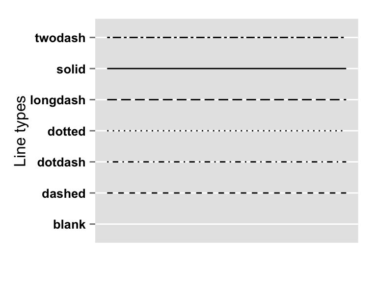
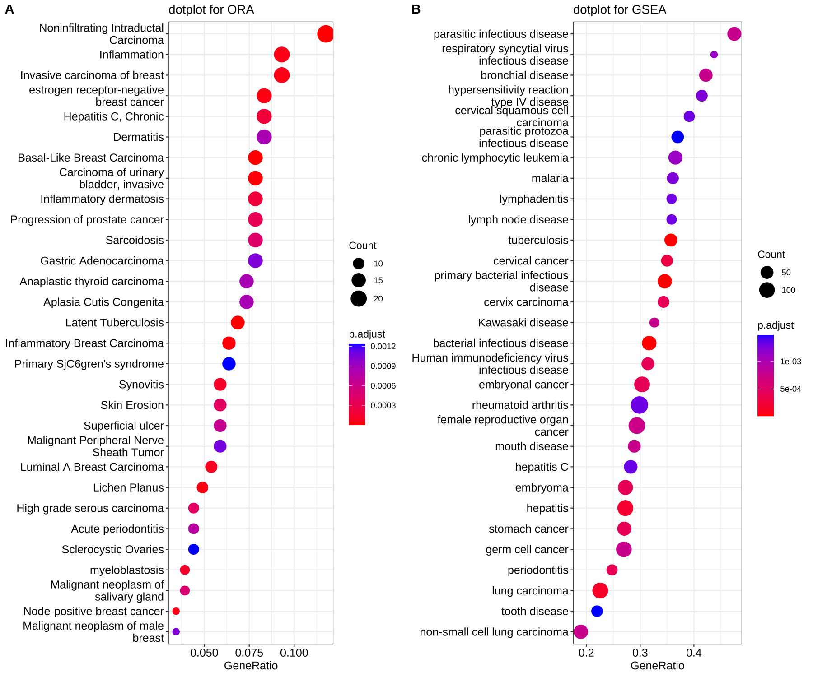

```{r setup, include=FALSE}
options(htmltools.dir.version = FALSE)
library(tidyverse)
library(janitor)
library(ggplot2)
library(plotly)
library(ComplexHeatmap)

wc3_units <- read_tsv('https://raw.githubusercontent.com/ubogoeva/tidyverse_tutorial/master/data/wc3_heroes.txt',
                      col_names = TRUE, 
                      na = '-', 
                      name_repair = 'minimal') %>% 
  janitor::clean_names()
```

Чтобы загрузить данные wc3_units:

```r
library(janitor)
wc3_units <- read_tsv('https://raw.githubusercontent.com/ubogoeva/tidyverse_tutorial/master/data/wc3_heroes.txt',
                      col_names = TRUE, 
                      na = '-', 
                      name_repair = 'minimal') %>% 
  janitor::clean_names()
```

---
.pull-left[
### Задание 1
Используя `ggplot2` нарисуйте график плотности вероятности (***geom_density***) для юнита каждой рассы иметь определенное количество hp. Настройте прозрачность (***alpha***).
]
.pull-right[
```{r, echo=FALSE, tidy=FALSE, warning=FALSE}
wc3_units %>%
  ggplot(aes(x=hp, fill=race)) +
  geom_density(alpha=0.5)
```
]
---
.pull-left[
### Задание 2
<br>Нарисуйте зависимость ***sight*** от ***speed*** по каждой расе.
<br>Какую геометрию нужно использовать?
]
.pull-right[
```{r, echo=FALSE, tidy=FALSE, warning=FALSE}
wc3_units %>%
  ggplot(aes(sight, speed, color = race)) +
  geom_point(size=4)
```
]
---
.pull-left[
### Задание 3
Для выполнения следующего задания сгруппируйте данные по колонкам ***armor_type*** и ***race***, и посчитайте количество юнитов представленных в каждой подгруппе.
]
.pull-right[
```{r, result='asis', echo=FALSE, warning=FALSE, message=FALSE}
tmp<-wc3_units %>%
  group_by(armor_type, race) %>%
  summarise(n=n())
knitr::kable((tmp), format = 'html')
```
]
---
.pull-left[
### Задание 3
Далее поменяте тип колонки ***armor_type*** на фактор и установите последовательность уровней от самой слабой брони к самой сильной. Используя полученные данные нарисуйте ***bar***plot.
```r
levels=c("Unarmored", "Light", "Medium",
                           "Heavy", "Fort", "Invulnerable")
```
]
.pull-right[
```{r, echo=FALSE, tidy=FALSE, warning=FALSE, message=FALSE}
wc3_units %>%
  group_by(armor_type, race) %>%
  summarise(n=n()) %>%
  mutate(armor_type =
           factor(armor_type,
                  levels=c("Unarmored", "Light", "Medium",
                           "Heavy", "Fort", "Invulnerable"))) %>%
  ggplot(aes(x=armor_type, y=n, fill=race)) +
  geom_bar(stat="identity")
```
]
---
.pull-left[
### Задание 4
Модифицируйте полученный код используя параметр ***position*** внутри geom_bar(). Для того чтобы узнать какие значения он принимает на вход используйте ***help*** или **google** ;)
]
.pull-right[
```{r, echo=FALSE, tidy=FALSE, warning=FALSE, message=FALSE}
wc3_units %>%
  group_by(armor_type, race) %>%
  summarise(n=n()) %>%
  mutate(armor_type =
           factor(armor_type,
                  levels=c("Unarmored", "Light", "Medium",
                           "Heavy", "Fort", "Invulnerable"))) %>%
  ggplot(aes(x=armor_type, y=n, fill=race)) +
  geom_bar(stat="identity", position="dodge")
```
]
---
.pull-left[
### Задание 5
Поменяйте тип геометрии на ***geom_point()***. Не забудьте проверить какой тип aesthetics поддерживает заданный параметр ***shape***. И добавьте слой ***geom_line***. В параметр ***linetype*** задайте нужный тип линии. Поэкспериментируйте с задачей параметра ***size***.

]
.pull-right[
```{r, echo=FALSE, tidy=FALSE, warning=FALSE, message=FALSE}
wc3_units %>%
  group_by(armor_type, race) %>%
  summarise(n=n()) %>%
  mutate(armor_type =
           factor(armor_type,
                  levels=c("Unarmored", "Light", "Medium",
                           "Heavy", "Fort", "Invulnerable"))) %>%
  ggplot(aes(x=armor_type, y=n, color=race)) +
  geom_point(shape=16, size =4) +
  geom_line(aes(group=race), size=1.5, linetype = "dashed")
```
]
---
.pull-left[
### Задание 6
<br>библиотека [`ClusterProfiler`](https://yulab-smu.top/biomedical-knowledge-mining-book/enrichplot.html) предоставляет готовые функции для отрисовки графиков для визуализации результатов анализа генной онтологии, попробуем сами запрограммировать dotplot() на данных wc3_units.
<br>
<br>Начнем с подготовки данных --->

]
.pull-right[


]
---
.pull-left[
### Задание 6
<br>Вашим заданием будет нарисовать среднее количество ***dps*** по каждому ***типу брони***, цветом мы отобразим средний урон (***damage***), а размером среднее количество ***hp***.
<br>
<br>Для этого
  - отфильтруем строки таблицы без пропущенных значений нужных нам колонок *(armor_type, unit, dps, hp, damage)*.Чтобы найти строки без пропущенных значений используйте функцию ***complete.cases()***.
  - сгруппируйте данные по ***armor_type***.
  - просуммируйте данные в количество юнитов , среднее dps, средее hp и средний damage покаждому типу брони

]
.pull-right[
<br>
<br>
```{r,result='asis', echo=FALSE, tidy=FALSE}
tmp <- wc3_units %>%
   filter(complete.cases(armor_type, unit, dps, hp, damage)) %>%
  group_by(armor_type) %>%
  summarise(n_units = n(), 
            mean_dps=mean(dps),
            mean_hp=mean(hp),
            mean_damage=mean(damage)) %>%
  as.data.frame() %>%
  mutate_if(is.numeric, round, digits=1)

knitr::kable(tmp, format = 'html')
```
]
---
.pull-left[
### Задание 6
<br>Теперь передайте полученную табличку в ***ggplot()** и допишите код для построения графика.
<br>Для установки градиента вам понадобится функция ***scale_color_gradient()***.
<br>Тема которую использует `ClusterProfiler` есть среди готовых тем [`ggplot2`](https://ggplot2.tidyverse.org/reference/ggtheme.html).

]
.pull-right[
```{r, echo=FALSE, tidy=FALSE, warning=FALSE, message=FALSE}
wc3_units %>%
   filter(complete.cases(armor_type, unit,dps, hp, damage)) %>%
  group_by(armor_type) %>%
  summarise(n_units = n(), 
            mean_dps=mean(dps),
            mean_hp=mean(hp),
            mean_damage=mean(damage)) %>%
  ggplot(aes(x=mean_dps, y= armor_type, color=mean_damage, size= mean_hp)) +
  geom_point() +
  scale_color_gradient(high="red",low="blue") +
  theme_bw() + ggtitle("Just like ClusterProfiler")
```
]
---
