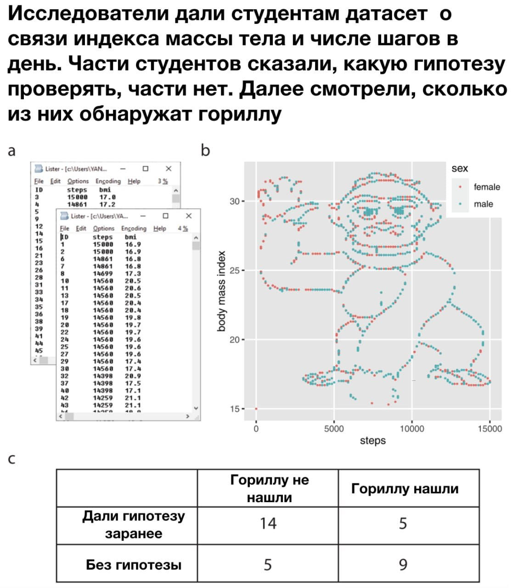
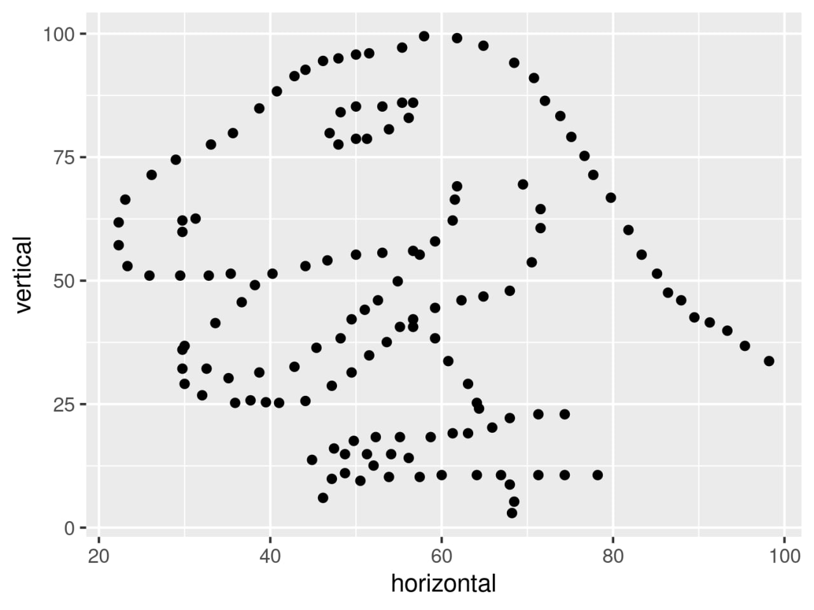
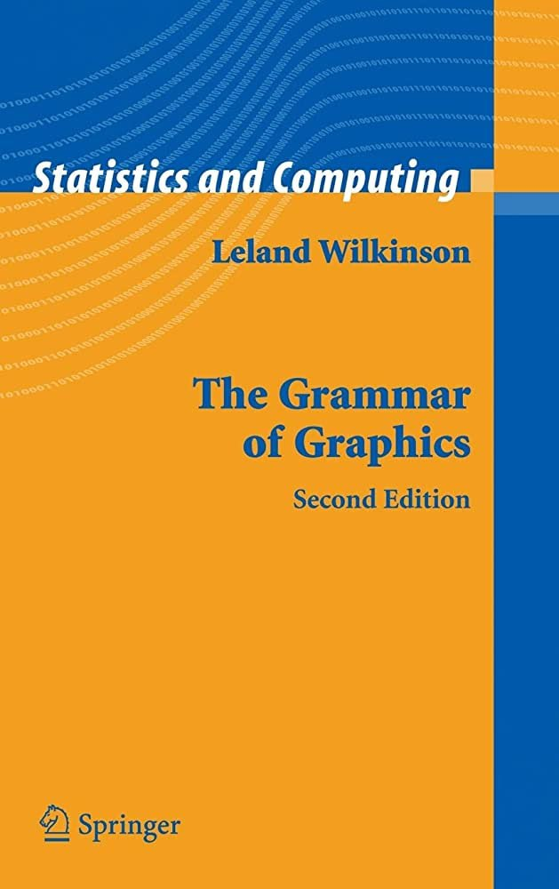
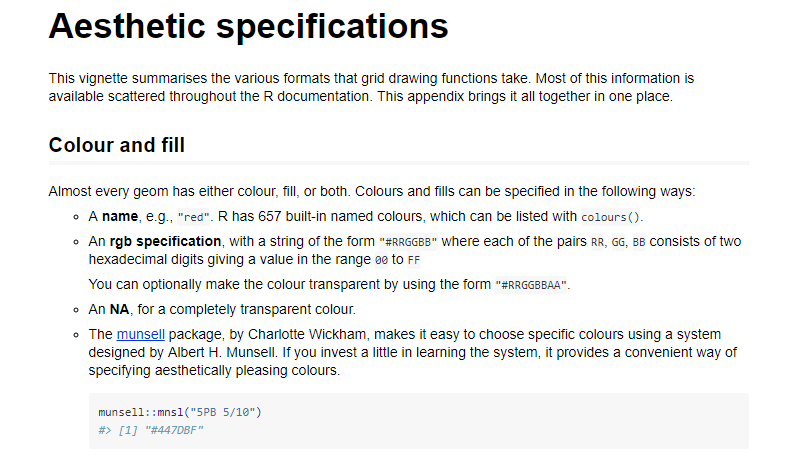
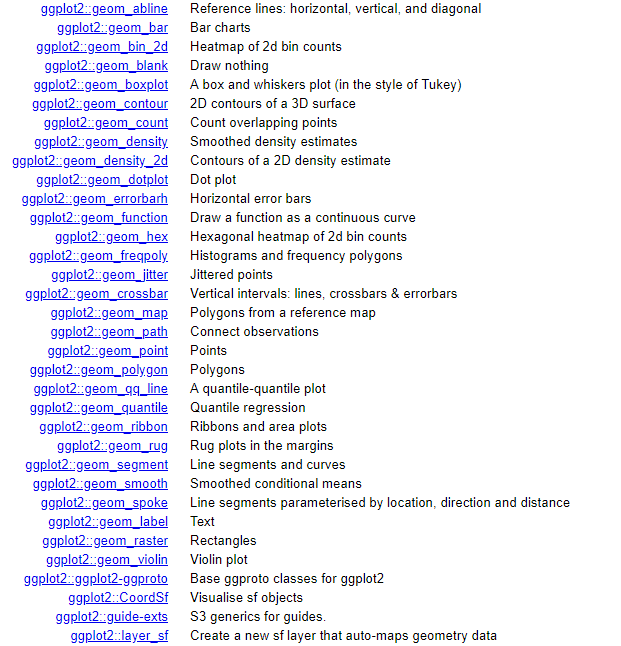
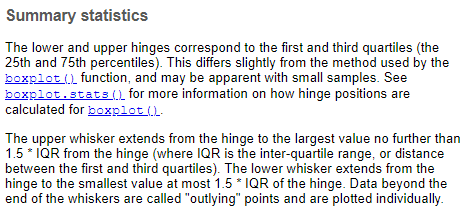
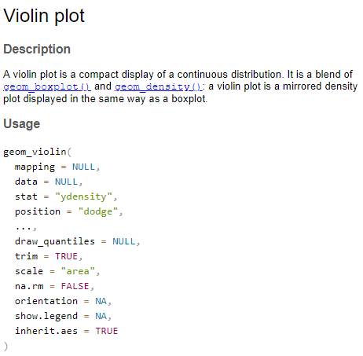
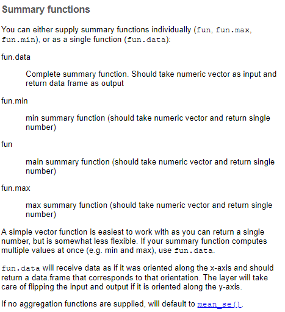
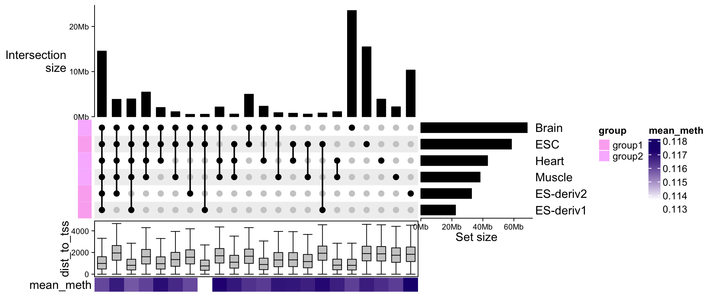
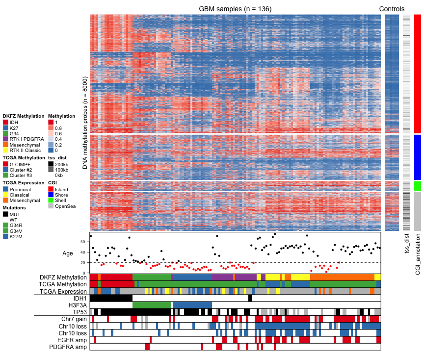

```{r setup, include=FALSE}
options(htmltools.dir.version = FALSE)
library(tidyverse)
library(janitor)
library(ggplot2)
library(plotly)
library(ComplexHeatmap)

wc3_units <- read_tsv('https://raw.githubusercontent.com/ubogoeva/tidyverse_tutorial/master/data/wc3_heroes.txt',
                      col_names = TRUE, 
                      na = '-', 
                      name_repair = 'minimal') %>% 
  janitor::clean_names()

# knitr::opts_chunk$set(
#   fig.width = 16, 
#   fig.height = 8, 
#   dpi = 300
# )
```

class: inverse, center, middle

# baser r plots
---
### Важность визуализации
.pull-left[

]
.pull-right[

]
---
### Какие можно вспомнить виды графиков?

 - Диаграмма рассеяния (scatterplot)
 
--

 - Гистограмма (histogram)
 
--

 - Барплот (barplot)
 
--

<br>**Чем барплот отличается от гистограммы?**

--

<br>Гистограммы для непрерывных величин, а барплоты для категориальных.

--

 - Боксплот (boxplot)

--

 - Скрипичная диаграмма (violin plot)

--

 - Pie chart (не рекомендуется)

--

 - Диаграмма Венна

--

 - Heatmap, density plot, upset, flowchart и много чего еще…
 
---
# mtcars
Мы будем работать с датасетом `mtcars` (Motor Trend Car Road Tests)
--
<br>Чтобы посмотреть описание датасета вобьем в консоль

```{r, echo=TRUE, tidy=FALSE, eval=FALSE}
?mtcars
```
--
A data frame with 32 observations on 11 (numeric) variables.
<br>[, 1]	mpg	Miles/(US) gallon
<br>[, 2]	cyl	Number of cylinders
<br>[, 3]	disp	Displacement (cu.in.)
<br>[, 4]	hp	Gross horsepower
<br>[, 5]	drat	Rear axle ratio
<br>[, 6]	wt	Weight (1000 lbs)
<br>[, 7]	qsec	1/4 mile time
<br>[, 8]	vs	Engine (0 = V-shaped, 1 = straight)
<br>[, 9]	am	Transmission (0 = automatic, 1 = manual)
<br>[,10]	gear	Number of forward gears
<br>[,11]	carb	Number of carburetors
---
# mtcars
```{r, result='asis', echo=FALSE}
DT::datatable(
  mtcars,
  fillContainer = FALSE, options = list(pageLength = 6, pageLength=9)
)
```
---
# mtcars
.left-column[
Чтобы посмотреть описательные статистики датасета наберем в консоли:
```{r, eval=FALSE, echo=TRUE}
summary(mtcars)
```
<br>
<br>
<br>
<br>
<br>
<br>
<br>
<br>
<br>
]
.right-column[
```{r, echo=FALSE, tidy=FALSE}
summary(mtcars)
```
]
---
# Диаграмма рассеяния (scatterplot)
.pull-left[
```r
plot(mtcars$mpg)
```
<br>На диаграмме рассеяния каждому наблюдению соответствует точка, координаты которой равны значениям двух каких-то параметров этого наблюдения.
<br>
<br>mpg - расход топлива
<br>**index** - порядок значений колонки mpg в таблице


]
.pull-right[
```{r, echo=FALSE, tidy=FALSE}
plot(mtcars$mpg)
```
]
---
# Scatterplots
.pull-left[
```r
plot(x = mtcars$disp, y = mtcars$mpg)
```
равнозначные обозначения
```r
plot(mtcars$disp ~ mtcars$mpg)
```
<br>
<br>mpg - расход топлива (Miles/(US) gallon)
<br>нарисуем зависимость mpg от displacement  
]
.pull-right[
```{r, echo=FALSE, tidy=FALSE}
#нарисуем зависимость displacement от mpg
plot(x = mtcars$disp, y = mtcars$mpg)
```

]
---
# Scatterplots
.pull-left[
```r
plot(mtcars$wt,
*    type="b")
```
аргумент **type =.** 
<br>type = "p", default
<br>just lines (type = "l") 
<br>both points and lines connected (type = "b")
<br>both points and lines with the lines running through the points (type = "o")
<br>empty points joined by lines (type = "c")
]
.pull-right[
```{r, echo=FALSE, tidy=FALSE}
#нарисуем вес
plot(mtcars$wt, type = "b")
```
]
---

# Histograms
.pull-left[
<br>Позволяет быстро посмотреть на распределение своих данных
```{r, eval=FALSE}
hist(mtcars$cyl)
```
<br> По оси **х** - частота или количество машин с конкретным количеством цилиндров (**cyl**)

<br> наглядное представление функции плотности вероятности некоторой случайной величины, построенное по выборке
]
.pull-right[

```{r, echo=FALSE, tidy=FALSE}
hist(mtcars$wt)
```
]
---
# Histograms
.pull-left[
```r
hist(mtcars$wt, 
*main = "Title", ylab="y", xlab="x",
*col="coral", border="blue")
```
]
.pull-right[
```{r, echo=FALSE, tidy=FALSE}
hist(mtcars$wt, 
    main = "Title", ylab="y", xlab="x",
    col="coral", border="blue")
```
]
---
# Histograms
.pull-left[
```r
hist(mtcars$wt, 
     main = "Title", ylab="y", xlab="x",
*    col = rainbow(25), 
     border="blue")
```
rainbow() автоматически применяет градиент от красного к зеленому
```{r, eval=TRUE, echo=TRUE}
 rainbow(5)
```
]
.pull-right[
```{r, echo=FALSE, tidy=FALSE}
hist(mtcars$wt, 
     main = "Title", ylab="y", xlab="x",
     col = rainbow(25), 
     border="blue")
```
]
---
# Histograms
.pull-left[
```r
hist(mtcars$wt, 
     main = "Title", ylab="y", xlab="x",
*    col = terrain.colors(12), 
     border="blue")
```
Можно поэкспериментировать с числом, которое подается функции **terrain.colors()**
]
.pull-right[
```{r, echo=FALSE, tidy=FALSE}
hist(mtcars$wt, 
     main = "Title", ylab="y", xlab="x",
     col = terrain.colors(12), 
     border="blue")
```
]
---

# Оффтопик
.pull-left[
base r pallets
```{r, tidy=FALSE}
head(hcl.pals())
```
пример использования
```r
hist(mtcars$wt, 
     main = "Title", ylab="y", xlab="x",
*    col = hcl.colors(20,"Pastel 1"), 
     border="blue")
```
]
.pull-right[
```{r, echo=FALSE, tidy=FALSE}
hist(mtcars$wt, 
     main = "Title", ylab="y", xlab="x",
     col = hcl.colors(20,"Pastel 1"), 
     border="blue")
```

<br>rainbow(n, s = 1, v = 1, start = 0, end = max(1, n - 1)/n,
        alpha, rev = FALSE)
<br>heat.colors(n, alpha, rev = FALSE)
<br>terrain.colors(n, alpha, rev = FALSE)
<br>topo.colors(n, alpha, rev = FALSE)
<br>cm.colors(n, alpha, rev = FALSE)
<br>[Rcolor.pdf](http://www.stat.columbia.edu/~tzheng/files/Rcolor.pdf)
]
---
# Histograms
.pull-left[
```r
hist(mtcars$wt, 
     main = "Title", ylab="y", xlab="x",
     col = terrain.colors(12), 
     border="blue",
*    freq = FALSE)
```
По умолчанию по оси **у** отложена частота (frequency)
<br>Если выставить freq = FALSE значение на оси **у** изменится на пллотность (density)
<br>Данные разбиты на **bins**, каждый бин - интервал данных.
]
.pull-right[

```{r, echo=FALSE, tidy=FALSE}
hist(mtcars$wt, main = "Title", freq = FALSE, ylab="y", xlab="x",
     col = terrain.colors(12))
```
]
---
# Histograms
.pull-left[
```r
hist(mtcars$wt, 
     main = "Title", ylab="y", xlab="x",
     col = terrain.colors(12), 
     border="blue",
     freq = FALSE)
*lines(density(mtcars$wt))
```
]
.pull-right[
```{r, echo=FALSE, tidy=FALSE}
hist(mtcars$wt, main = "Title", freq = FALSE, ylab="y", xlab="x",
     col = terrain.colors(12))
lines(density(mtcars$wt))
```
]
---


# Boxplot
.pull-left[
```r
boxplot(mtcars$mpg, ylab = "y")
```
график, использующийся в описательной статистике, компактно изображающий одномерное распределение вероятностей.
<br>
<br>Такой вид диаграммы в удобной форме показывает **медиану** (или, если нужно, среднее), нижний и верхний **квартили**, **минимальное** и **максимальное** значение выборки и **выбросы**.

]
.pull-right[

```{r, echo=FALSE, tidy=FALSE}
boxplot(mtcars$mpg, ylab = "y")
```
]
---
# Boxplot
.pull-left[
```r
boxplot(mtcars$mpg ~ mtcars$cyl, 
*       main = "Title",
*       col="lightblue")
```
Дополнительная кастомизация
]
.pull-right[
```{r, echo=FALSE, tidy=FALSE}
boxplot(mtcars$mpg ~ mtcars$cyl, main = "Title",col="lightblue")
```
]
---
.pull-left[
### Другие типы плотов в base r
```r
par(mfrow=c(3, 1))
### stripchart()
stripchart(mtcars$mpg,
           main = "Mpg",
           method="jitter",
           col = "orange",
           pch=10)
### barplot()
barplot(mtcars$mpg[1:6], 
main = "Первые 6 наблюдений расхода топлива", 
        ylab = "Miles/(US) gallon",
        names.arg = row.names(mtcars)[1:6],
        col = terrain.colors(10)
)
### q-q plot 
qqnorm(mtcars$mpg, pch = 1, frame = FALSE)
qqline(mtcars$mpg, col = "steelblue", lwd = 2)
```
Для дальнейшей кастомизации: [CheatSheet](https://r-graph-gallery.com/6-graph-parameters-reminder.html)
]
.pull-right[
```{r, echo=FALSE, tidy=FALSE}
par(mfrow=c(3, 1))
### stripchart()
stripchart(mtcars$mpg,
           main = "Mpg",
           method="jitter",
           col = "orange",
           pch=10)
### barplot()
barplot(mtcars$mpg[1:6], main = "Первые 6 наблюдений расхода топлива", 
        ylab = "Miles/(US) gallon",
        names.arg = row.names(mtcars)[1:6],
        col = terrain.colors(10)
)
### q-q plot 
qqnorm(mtcars$mpg, pch = 1, frame = FALSE)
qqline(mtcars$mpg, col = "steelblue", lwd = 2)
```
]
---

class: inverse, center, middle

# ggplot2!!
---
.pull-left[
### Grammar of graphics
<br>
<br>
<br>Подход к построению графиков в `ggplot2` принципиально отличается от обычных пакетов визуализации (matplotlib, seaborn в питоне). 
<br>Фишка `ggplot2` состоит в применении языка грамматики графики - набора правил для построения графиков. 
<br>Такой подход дает огромную гибкость и возможность создания и кастомизации практически любого графика. Пакет опирается на книгу The Grammar of Graphics (Leland Wilkinson).
]
.pull-right[

]
---
class: fullscreen, top, center
background-image: url("img/ggp.jfif")

.right[https://twitter.com/tanya_shapiro/status/1576935152575340544]
---
# ggplot2
<br>[ggplot2 tutorial](https://ggplot2.tidyverse.org)
<br>Установка библиотеки:
```{r eval=FALSE, tidy=FALSE}
install.packages("ggplot2")
```
`ggplot2` входит в core `tidyverse`, так что если вы уже установили `tidyverse` отдельно устанавливать `ggplot2` не надо
---
# wc3_units
```{r, result='asis', echo=FALSE}
DT::datatable(
  wc3_units,
  #fillContainer = TRUE, 
  options = list(pageLength = 6,
  columnDefs = list(list(className = 'dt-center', targets = 5))
  )
)
```
---
# wc3_units 2
```{r, result='asis', echo=FALSE}
knitr::kable(head(wc3_units), format = 'html')
```
---
.pull-left[
### ggplot()
```r
*ggplot(data = wc3_units)
```
WarCraft3 dataset
]
.pull-right[
ggplot() функции подается датафрейм
```{r, echo=FALSE, tidy=FALSE}
ggplot(data = wc3_units)
```
]
---
.pull-left[
### aes()
```r
ggplot(data = wc3_units, 
*       aes(x = race, y = hp))
```
<br>aes = aesthetics
<br>aes() отражает, какие переменные и как мы собираемся использовать в графике. Здесь мы прописали, что по X будет race, по Y hp.
]
.pull-right[

```{r, echo=FALSE, tidy=FALSE}
ggplot(data = wc3_units, 
       aes(x = race, y = hp))
```
]
---
.pull-left[
### geom_()
```r
ggplot(data = wc3_units, 
       aes(x = race, y = hp)) +
*  geom_point()
```
geom = geometry
]
.pull-right[

```{r, echo=FALSE, tidy=FALSE}
ggplot(data = wc3_units, 
       aes(x = race, y = hp)) +
  geom_point()
```
]
---
.pull-left[
### aes()
```r
ggplot(data = wc3_units, 
*       aes(x = race, y = hp)) +
  geom_point()
```
Вернемся к aes() и рассмотрим подробнее
]
.pull-right[
```{r, echo=FALSE, tidy=FALSE}
ggplot(data = wc3_units, 
       aes(x = race, y = hp)) +
  geom_point()
```
]
---
# ggplot aesthetics (параметры)


---
.pull-left[
### color
```r
wc3_units %>% 
*  ggplot(aes(race, hp, color = armor_type)) +
  geom_point()
```
```r
?aes
```
]
.pull-right[
```{r, echo=FALSE, tidy=FALSE, , warning=FALSE}
wc3_units %>% 
  ggplot(aes(race, hp, color = armor_type)) +
  geom_point()
```
]
---
.pull-left[
### geom aesthetics
<br>aes() можно задавать как внутри ggplot(), так и внутри geoms
<br>Например:
<br>geom_point() understands the following aesthetics (required aesthetics are in bold):
 - **x**
 - **y**
 - alpha
 - colour
 - fill
 - group
 - shape
 - size
 - stroke
]
.pull-right[

]

---
.pull-left[
### shape
```r
wc3_units %>% 
  ggplot(aes(race, hp, color = armor_type)) +
*  geom_point(aes(shape = air_attack), 
*   size = 5, alpha = 0.5)
```
```{r, echo=FALSE, tidy=FALSE, , warning=FALSE}
shapes <- data.frame(
  shape = c(0:19, 22, 21, 24, 23, 20),
  x = 0:24 %/% 5,
  y = -(0:24 %% 5)
)
ggplot(shapes, aes(x, y)) + 
  geom_point(aes(shape = shape), size = 5, fill = "red") +
  geom_text(aes(label = shape), hjust = 0, nudge_x = 0.15) +
  scale_shape_identity() +
  expand_limits(x = 4.1) +
  theme_void()
```
]
.pull-right[
```{r, echo=FALSE, tidy=FALSE, , warning=FALSE}
wc3_units %>% 
  ggplot(aes(race, hp, color = armor_type)) +
  geom_point(aes(shape = air_attack), size = 5, alpha = 0.5)
```
]
---
.pull-left[
### позиционирование параметров
```r
wc3_units %>% 
  ggplot(aes(race, hp, color = armor_type)) +
*  geom_point(aes(shape = air_attack, 
*  size = armor, alpha = sight))
```
 - **shape**, **size** и **alpha** появились в легенде
]
.pull-right[
```{r, echo=FALSE, tidy=FALSE, , warning=FALSE}
wc3_units %>% 
  ggplot(aes(race, hp, color = armor_type)) +
  geom_point(aes(shape = air_attack, size = armor, alpha = sight))
```
]
---
# Типы геометрий
Чтобы увидеть все доступные типы геометрий с описанием введите в консоли:
```{r, echo=TRUE, tidy=FALSE, eval=FALSE}
??geom_
```
Или начните вводить **geom_** и нажмите **Tab**
---

---
<br>Перед тем как начать подробно рассматривать геометрии
<br>Для построения графиков нам нужно будет модифицировать данные
<br>Мы рассмотрим два способа:
 - **stat_summary()** внутри ggplot 
 - подготовка данных при помощи **dplyr** (group_by(), summarise(), pivot_longer()) 
<br>
<br>
<br>Примеры будут по ходу лекции

---

.pull-left[
### geom_point()
```r
ggplot(data = wc3_units, 
       aes(x = gold, y = hp)) +
*  geom_point()
```
<br> **geom_point()** - отрисовывает переменные, поданные в аэстетики (aes), в виде точек. Получилась обычная диаграмма рассеяния!

<br>geom_point(
<br>  mapping = NULL,
<br>  data = NULL,
<br>  stat = "identity",
<br>  position = "identity",
<br>  ...,
<br>  na.rm = FALSE,
<br>  show.legend = NA,
<br>  inherit.aes = TRUE
<br>)

]
.pull-right[
```{r, echo=FALSE, tidy=FALSE, warning=FALSE}
ggplot(data = wc3_units, 
       aes(x = gold, y = hp)) +
  geom_point()
```
]

---

.pull-left[
### geom_point()
```r
wc3_units %>% 
  ggplot(aes(x = damage, y = gold))+
  geom_point(size = 4)
```
Построим зависимость damage от gold
]
.pull-right[
```{r, echo=FALSE, tidy=FALSE, warning=FALSE}
wc3_units %>% 
  ggplot(aes(x = damage, y = gold))+
  geom_point(size = 4)
```

]
---
.pull-left[
### geom_smooth()
```r
wc3_units %>% 
  ggplot(aes(x = damage, y = gold))+
  geom_point(size = 4)+
*  geom_smooth()
```
<br>Добавим регрессионную линию с помощью geom_smooth()
<br>По умолчанию линия не прямая, пытается максимально приблизить точки.
]
.pull-right[
```{r, echo=FALSE, tidy=FALSE, warning=FALSE}
wc3_units %>% 
  ggplot(aes(x = damage, y = gold))+
  geom_point(size = 4)+
  geom_smooth()
```

]
---
.pull-left[
### geom_smooth()
```r
wc3_units %>% 
  ggplot(aes(x = damage, y = gold))+
  geom_point(size = 4)+
*  geom_smooth(method = 'lm')
```
<br>Добавим регрессионную прямую с помощью geom_smooth(method = 'lm')
]
.pull-right[
```{r, echo=FALSE, tidy=FALSE, warning=FALSE}
wc3_units %>% 
  ggplot(aes(x = damage, y = gold))+
  geom_point(size = 4)+
  geom_smooth(method = 'lm')
```

]
---
.pull-left[
### geom_smooth()
```r
wc3_units %>% 
  ggplot(aes(x = damage, y = gold, 
*             color = race))+
  geom_point(size = 4)+
  geom_smooth(method = 'lm')
```
<br>Добавим race юнитов с помощью цвета color в aes()

<br>Обратите внимание, как прописываются aesthetics. В функции ggplot() применяются на всем графике, на всех geoms, поэтому geom_smooth() строит регрессию отдельно по каждой расе. 
<br>Если бы мы хотели построить регрессию по всему датасету, то аэстетику цвета нужно было бы прописать отдельно в geom_point()
]
.pull-right[
```{r, echo=FALSE, tidy=FALSE, warning=FALSE}
wc3_units %>% 
  ggplot(aes(x = damage, y = gold, 
             color = race))+
  geom_point(size = 4)+
  geom_smooth(method = 'lm')
```

]
---
.pull-left[
### geom_smooth()
```r
wc3_units %>% 
  ggplot(aes(x = damage, y = gold))+
*  geom_point(aes(color = race), 
  size = 4)+
  geom_smooth(method = 'lm')
```
<br>Если бы мы хотели построить регрессию по всему датасету, то аэстетику цвета нужно было бы прописать отдельно в geom_point()
]
.pull-right[
```{r, echo=FALSE, tidy=FALSE, warning=FALSE}
wc3_units %>% 
  ggplot(aes(x = damage, y = gold, 
             ))+
  geom_point(aes(color = race), size = 4)+
  geom_smooth(method = 'lm')
```

]
---
.pull-left[
### geom_histogram()
```r
wc3_units %>% 
  ggplot(aes(hp)) +
*  geom_histogram()
```
По умолчанию по оси у отложено количество наблюдений в диапазоне, определенном параметром bins или binwidth
]
.pull-right[
```{r, echo=FALSE, tidy=FALSE, message = FALSE}
wc3_units %>% 
  ggplot(aes(hp)) +
  geom_histogram()
```
]
---
.pull-left[
### geom_histogram() 
### bins
```r
wc3_units %>% 
  ggplot(aes(hp)) +
*  geom_histogram(bins = 5)
```
bins определяет количество долей на которые будут разделены данные
]
.pull-right[
```{r, echo=FALSE, tidy=FALSE, message = FALSE}
wc3_units %>% 
  ggplot(aes(hp)) +
  geom_histogram(bins = 5)
```
]
---
.pull-left[
### geom_histogram() 
### binwidth
```r
wc3_units %>% 
  ggplot(aes(hp)) +
*  geom_histogram(binwidth = 20)
```
binwidth определяет какого размера будут bins
]
.pull-right[
```{r, echo=FALSE, tidy=FALSE, message = FALSE}
wc3_units %>% 
  ggplot(aes(hp)) +
  geom_histogram(binwidth = 20)
```
]
---
.pull-left[
### geom_histogram()
```r
wc3_units %>% 
  ggplot(aes(hp)) +
  geom_histogram(binwidth = 40,
*  colour = 4, fill = "white")
```
]
.pull-right[
```{r, echo=FALSE, tidy=FALSE, message = FALSE}
wc3_units %>% 
  ggplot(aes(hp)) +
  geom_histogram(binwidth = 40,colour = 4, fill = "white")
```
]
---
.pull-left[
### geom_boxplot()
```r
wc3_units %>%
    ggplot(aes(race, hp)) +
*  geom_boxplot()
```
В описании к geom_boxplot() отмечено что подсчет статистик для него отличается от baser функции boxplot()

]
.pull-right[
```{r, echo=FALSE, tidy=FALSE, message = FALSE}
wc3_units %>% 
  ggplot(aes(race,hp)) +
  geom_boxplot()
```
]
---
.pull-left[
### geom_violin()
```r
wc3_units %>%
    ggplot(aes(race, hp)) +
*  geom_violin()
```

]
.pull-right[
```{r, echo=FALSE, tidy=FALSE, message = FALSE}
wc3_units %>% 
  ggplot(aes(race,hp)) +
  geom_violin()
```
]
---

.pull-left[
### geom_bar()
```r
wc3_units %>% 
  ggplot(aes(hp)) +
*  geom_bar()
```
]
.pull-right[
```{r, echo=FALSE, tidy=FALSE}
wc3_units %>% 
  ggplot(aes(hp)) +
  geom_bar()
```
по умолчанию параметр stat = "count"
]
---
.pull-left[
### geom_bar()
Приведем таблицу к виду:
```{r, echo=TRUE, tidy=FALSE}
wc3_units %>% 
  group_by(race) %>%
  summarise(mean_hp=mean(hp))
```
и построим график
```r
wc3_units %>% 
  group_by(race) %>%
  summarise(mean_hp=mean(hp)) %>%
  ggplot(aes(race, mean_hp)) +
*  geom_bar(stat = "identity")
```

]
.pull-right[
Чтобы посмотреть на средние значения по расе:
```{r, echo=FALSE, tidy=FALSE}
#Чтобы посмотреть на средние значения по расе:
wc3_units %>% 
  group_by(race) %>%
  summarise(mean_hp=mean(hp)) %>%
  ggplot(aes(race, mean_hp)) +
  geom_bar(stat = "identity") 
```
]
---

.pull-left[
### geom_bar()

```r
wc3_units %>% 
  group_by(race) %>%
  summarise(mean_hp=mean(hp)) %>%
  ggplot(aes(race, mean_hp, 
*  fill=mean_hp)) +
  geom_bar(stat = "identity")  +
* scale_fill_gradient2(low="blue", high="red", 
* midpoint = 550)
```
<br>scale_fill_gradient позволяет выставить градиент

]
.pull-right[
```{r, echo=FALSE, tidy=FALSE}
wc3_units %>% 
  group_by(race) %>%
  summarise(mean_hp=mean(hp)) %>%
  ggplot(aes(race, mean_hp, fill=mean_hp)) +
  geom_bar(stat = "identity")  +
scale_fill_gradient2(low="blue", high="red", midpoint = 550)
```
]
---
.pull-left[
### stat_summary()
```r
wc3_units %>% 
  ggplot(aes(race, hp)) +
*  stat_summary(geom = "bar", fun="mean")
```

]
.pull-right[
```{r, echo=FALSE, tidy=FALSE}
wc3_units %>% 
  ggplot(aes(race, hp)) +
  stat_summary(geom = "bar", fun="mean")
```
то же самое можно задать при помощи **stat_summary()**
]
---

.pull-left[
### stat_summary()
```r
wc3_units %>% 
  ggplot(aes(race, hp)) +
  stat_summary(geom = "bar", fun="mean")+
*  stat_summary(geom = "errorbar", 
*  fun.data="mean_se", width = 0.2)
```
]
.pull-right[
```{r, echo=FALSE, tidy=FALSE}
wc3_units %>% 
  ggplot(aes(race, hp)) +
  stat_summary(geom = "bar", fun="mean")+
  stat_summary(geom = "errorbar", fun.data="mean_se", width = 0.2)
```
дорисуем усы со стандартной ошибкой среднего
]
---

.pull-left[
### Надстройки
```r
wc3_units %>% 
  ggplot(aes(race, hp)) +
  stat_summary(geom = "bar", fun="mean")+
  stat_summary(geom = "errorbar", 
  fun.data="mean_se", width = 0.2)+
*  geom_point()
```
<br>
<br>на основе этого кода потренируемся создавать сложные графики
<br>На одном плоте можно рисовать несколько геометрий
]
.pull-right[
```{r, echo=FALSE, tidy=FALSE}
wc3_units %>% 
  ggplot(aes(race, hp)) +
  stat_summary(geom = "bar", fun="mean")+
  stat_summary(geom = "errorbar", fun.data="mean_se", width = 0.2)+
  geom_point()
```
]
---
.pull-left[
### position_jitterdodge()
```r
wc3_units %>% 
  ggplot(aes(race, hp)) +
  stat_summary(geom = "bar", fun="mean")+
  stat_summary(geom = "errorbar", 
  fun.data="mean_se", width = 0.2)+
  geom_point(aes(color=armor_type),
* position = position_jitterdodge(seed=1))
```
Для воспроизводимости положения точек мы указываем **seed** (для создания списка "рандомных" позиций)
]
.pull-right[
```{r, echo=FALSE, tidy=FALSE}
wc3_units %>% 
  ggplot(aes(race, hp)) +
  stat_summary(geom = "bar", fun="mean")+
  stat_summary(geom = "errorbar", fun.data="mean_se", width = 0.2)+
  geom_point(aes(color=armor_type),position = position_jitterdodge(seed=1))
```
]
---
.pull-left[
### geom_text()
```r
plt <- 
wc3_units %>% 
  ggplot(aes(race, hp)) +
  stat_summary(geom = "bar", fun="mean")+
  stat_summary(geom = "errorbar", 
  fun.data="mean_se", width = 0.2)+
  geom_point(aes(color=armor_type),
  position = position_jitterdodge(seed=1))+
*  geom_text(aes(label = unit,color=armor_type), 
*  position = position_jitterdodge(seed = 1), 
* size = 3)
```
Чтобы позиции текста и точек совпали на графике необходимо чтобы **seed** указанный для geom_point() соответствовал значению **seed** у geom_text()
]
.pull-right[
```{r, echo=FALSE, tidy=FALSE}
wc3_units %>% 
  ggplot(aes(race, hp)) +
  stat_summary(geom = "bar", fun="mean")+
  stat_summary(geom = "errorbar", fun.data="mean_se", width = 0.2)+
  geom_point(aes(color=armor_type),position = position_jitterdodge(seed=1))+
  geom_text(aes(label = unit,color=armor_type), position = position_jitterdodge(seed = 1), size = 3)
```

]
---
.pull-left[
### theme_()
```r
plt + 
*  ggtitle("Title") +
*  xlab("x") +
*  ylab("y") +
*  theme_dark()
```
сохраним в переменную plt
```{r, echo=TRUE, tidy=FALSE}
#??theme
```
[base r themes](https://ggplot2.tidyverse.org/reference/ggtheme.html)
]
.pull-right[
```{r, echo=FALSE, tidy=FALSE}
wc3_units %>% 
  ggplot(aes(race, hp)) +
  stat_summary(geom = "bar", fun="mean")+
  stat_summary(geom = "errorbar", fun.data="mean_se", width = 0.2)+
  geom_point(aes(color=armor_type),position = position_jitterdodge(seed=1))+
  geom_text(aes(label = unit,color=armor_type), position = position_jitterdodge(seed = 1), size = 3) +
  ggtitle("Title") +
  xlab("x")+
  ylab("y")+ theme_dark()
```
]
---

.pull-left[
### theme()
```r
plt + 
  ggtitle("Title") +
  xlab("x") +
  ylab("y") +
*  theme(panel.border = element_rect(linetype = "dashed", fill = NA))

```
]
.pull-right[
```{r, echo=FALSE, tidy=FALSE}
wc3_units %>% 
  ggplot(aes(race, hp)) +
  stat_summary(geom = "bar", fun="mean")+
  stat_summary(geom = "errorbar", fun.data="mean_se", width = 0.2)+
  geom_point(aes(color=armor_type),position = position_jitterdodge(seed=1))+
  geom_text(aes(label = unit,color=armor_type), position = position_jitterdodge(seed = 1), size = 3) +
  ggtitle("Title") +
  xlab("x")+
  ylab("y")+ 
  theme(panel.border = element_rect(linetype = "dashed", fill = NA))

  
```
]
---
.pull-left[
### theme()
```r
plt + 
  ggtitle("Title") +
  xlab("x") +
  ylab("y") +
*  theme(axis.text = element_text(colour = "blue"))

```
]
.pull-right[
```{r, echo=FALSE, tidy=FALSE}
wc3_units %>% 
  ggplot(aes(race, hp)) +
  stat_summary(geom = "bar", fun="mean")+
  stat_summary(geom = "errorbar", fun.data="mean_se", width = 0.2)+
  geom_point(aes(color=armor_type),position = position_jitterdodge(seed=1))+
  geom_text(aes(label = unit,color=armor_type), position = position_jitterdodge(seed = 1), size = 3) +
  ggtitle("Title") +
  xlab("x")+
  ylab("y")+ 
  theme(axis.text = element_text(colour = "blue"))

  
```
]
---

.pull-left[
### theme()
```r
plt + 
  ggtitle("Title") +
  xlab("x") +
  ylab("y") +
*  theme(axis.text.x = element_text(angle = 90, 
* vjust = 0.5, hjust=1))

```
]
.pull-right[
```{r, echo=FALSE, tidy=FALSE}
wc3_units %>% 
  ggplot(aes(race, hp)) +
  stat_summary(geom = "bar", fun="mean")+
  stat_summary(geom = "errorbar", fun.data="mean_se", width = 0.2)+
  geom_point(aes(color=armor_type),position = position_jitterdodge(seed=1))+
  geom_text(aes(label = unit,color=armor_type), position = position_jitterdodge(seed = 1), size = 3) +
  ggtitle("Title") +
  xlab("x")+
  ylab("y")+ 
  theme(axis.text.x = element_text(angle = 90, vjust = 0.5, hjust=1))
  
```
]
---


.pull-left[
### scales
```r
plt + 
  scale_y_continuous(limits = c(0,600))

```
]
.pull-right[
```{r, echo=FALSE, tidy=FALSE, warning=FALSE}
wc3_units %>% 
  ggplot(aes(race, hp)) +
  stat_summary(geom = "bar", fun="mean")+
  stat_summary(geom = "errorbar", fun.data="mean_se", width = 0.2)+
  geom_point(aes(color=armor_type),position = position_jitterdodge(seed=1))+
  geom_text(aes(label = unit,color=armor_type), position = position_jitterdodge(seed = 1), size = 3) +
  ggtitle("Title") +
  xlab("x")+
  ylab("y")+ 
  scale_y_continuous(limits = c(0,600)) + 
  theme(axis.text.x = element_text(angle = 90, vjust = 0.5, hjust=1))
```
]
---

.pull-left[
### scales
```r
plt + 
*  scale_y_continuous(limits = c(0,1500), 
*  breaks = seq(0, 1500, 300))

```
]
.pull-right[
```{r, echo=FALSE, tidy=FALSE, warning=FALSE}
wc3_units %>% 
  ggplot(aes(race, hp)) +
  stat_summary(geom = "bar", fun="mean")+
  stat_summary(geom = "errorbar", fun.data="mean_se", width = 0.2)+
  geom_point(aes(color=armor_type),position = position_jitterdodge(seed=1))+
  geom_text(aes(label = unit,color=armor_type), position = position_jitterdodge(seed = 1), size = 3) +
  ggtitle("Title") +
  xlab("x")+
  ylab("y")+ 
scale_y_continuous(limits = c(0,1500), breaks = seq(0, 1500, 300)) +  theme(axis.text.x = element_text(angle = 90, vjust = 0.5, hjust=1))
```
]
---
.pull-left[
### facet_wrap()
```r
plt + 
  ggtitle("Title") +
  xlab("x") +
  ylab("y") +
  theme_bw() + 
*  facet_wrap(~armor_type)
```
]
.pull-right[
```{r, echo=FALSE, tidy=FALSE}
wc3_units %>% 
  ggplot(aes(race, hp)) +
  stat_summary(geom = "bar", fun="mean")+
  stat_summary(geom = "errorbar", fun.data="mean_se", width = 0.2)+
  geom_point(aes(color=armor_type),position = position_jitterdodge(seed=1))+
  ggtitle("Title") +
  xlab("x")+
  ylab("y")+ theme_bw() + 
  facet_wrap(~armor_type)
```
]
---

.pull-left[
### facet_wrap()
```r
plt + 
  ggtitle("Title") +
  xlab("x") +
  ylab("y") +
  theme_bw() + 
  facet_wrap(~armor_type, 
* scales = "free")
```
]
.pull-right[
```{r, echo=FALSE, tidy=FALSE}
wc3_units %>% 
  ggplot(aes(race, hp)) +
  stat_summary(geom = "bar", fun="mean")+
  stat_summary(geom = "errorbar", fun.data="mean_se", width = 0.2)+
  geom_point(aes(color=armor_type),position = position_jitterdodge(seed=1))+
  ggtitle("Title") +
  xlab("x")+
  ylab("y")+ theme_bw() + 
  facet_wrap(~armor_type, scales = "free")
```
]
---

.pull-left[
### factor levels
```r
wc3_units %>% 
*  mutate(armor_type = 
*           factor(armor_type, 
*                  levels=c("Unarmored", "Light", "Medium",
* "Heavy", "Fort", "Invulnerable"))) %>%
  ggplot(aes(race, hp)) +
  stat_summary(geom = "bar", fun="mean")+
  stat_summary(geom = "errorbar", 
  fun.data="mean_se", width = 0.2)+
  geom_point(aes(color=armor_type),
  position = position_jitterdodge(seed=1))+
  ggtitle("Title") +
  xlab("x")+
  ylab("y")+ theme_bw() + 
  facet_wrap(~armor_type)
```
]
.pull-right[
```{r, echo=FALSE, tidy=FALSE}
wc3_units %>% 
  mutate(armor_type = 
           factor(armor_type, 
                  levels=c("Unarmored", "Light", "Medium", "Heavy", "Fort", "Invulnerable"))) %>%
  ggplot(aes(race, hp)) +
  stat_summary(geom = "bar", fun="mean")+
  stat_summary(geom = "errorbar", fun.data="mean_se", width = 0.2)+
  geom_point(aes(color=armor_type),position = position_jitterdodge(seed=1))+
  ggtitle("Title") +
  xlab("x")+
  ylab("y")+ theme_bw() + 
  facet_wrap(~armor_type)
```
]
---
# ggplotly()
<br>пакет для создания интерактивных графиков
<br>[Туториал от Лены](https://t.me/stats_for_science/61)
<br>[plotly](https://plotly.com/r/getting-started/):

```{r eval=FALSE, tidy=FALSE}
install.packages("plotly")
```

<br>**echarts4r** — один из основных конкурентов для plotly. Симпатичный, работает довольно плавно, синтаксис тоже пытается вписаться в логику tidyverse.
<br>**leaflet** — основной (но не единственный!) пакет для работы с картами. Leaflet — это очень популярная библиотека JavaScript, используемая во многих веб-приложениях, а пакет leaflet - это довольно понятный интерфейс к ней с широкими возможностями.
<br>**networkD3** — пакет для интерактивной визуализации сетей. Подходит для небольших сетей.
---

.pull-left[
### ggplotly()
```r
ggplotly(plt)
```
]
.pull-right[
```{r, echo=FALSE, tidy=FALSE}
plt <- wc3_units %>% 
  mutate(armor_type = 
           factor(armor_type, 
                  levels=c("Unarmored", "Light", "Medium", "Heavy", "Fort", "Invulnerable"))) %>%
  ggplot(aes(race, hp)) +
  stat_summary(geom = "bar", fun="mean")+
  stat_summary(geom = "errorbar", fun.data="mean_se", width = 0.2)+
  geom_point(aes(color=armor_type),position = position_jitterdodge(seed=1))+
  ggtitle("Title") +
  xlab("x")+
  ylab("y")+ theme_bw() + 
  facet_wrap(~armor_type)
ggplotly(plt)
```
]
---
### Диаграмма Венна
[Диаграммы Венна в R](https://r-graph-gallery.com/14-venn-diagramm)
<br>
---
### UpSetR
<br>[UpSetR tutorial](https://jokergoo.github.io/ComplexHeatmap-reference/book/upset-plot.html)
<br> 
<br>
---
.left-code[
### ComplexHeatmap
[ComplexHeatmap](https://jokergoo.github.io/ComplexHeatmap-reference/book/):

```{r eval=FALSE, tidy=FALSE}
if (!require("BiocManager", quietly = TRUE))
    install.packages("BiocManager")

BiocManager::install("ComplexHeatmap")
```
[Примеры](https://github.com/jokergoo/ComplexHeatmap)
]
.right-plot[


]
---
### ComplexHeatmap
на вход подается матрица
```r
mat[1:8,1:8]
```

```{r, result='asis', echo=FALSE}
set.seed(123)
nr1 = 4; nr2 = 8; nr3 = 6; nr = nr1 + nr2 + nr3
nc1 = 6; nc2 = 8; nc3 = 10; nc = nc1 + nc2 + nc3
mat = cbind(rbind(matrix(rnorm(nr1*nc1, mean = 1,   sd = 0.5), nr = nr1),
          matrix(rnorm(nr2*nc1, mean = 0,   sd = 0.5), nr = nr2),
          matrix(rnorm(nr3*nc1, mean = 0,   sd = 0.5), nr = nr3)),
    rbind(matrix(rnorm(nr1*nc2, mean = 0,   sd = 0.5), nr = nr1),
          matrix(rnorm(nr2*nc2, mean = 1,   sd = 0.5), nr = nr2),
          matrix(rnorm(nr3*nc2, mean = 0,   sd = 0.5), nr = nr3)),
    rbind(matrix(rnorm(nr1*nc3, mean = 0.5, sd = 0.5), nr = nr1),
          matrix(rnorm(nr2*nc3, mean = 0.5, sd = 0.5), nr = nr2),
          matrix(rnorm(nr3*nc3, mean = 1,   sd = 0.5), nr = nr3))
   )
mat = mat[sample(nr, nr), sample(nc, nc)] # random shuffle rows and columns
rownames(mat) = paste0("row", seq_len(nr))
colnames(mat) = paste0("col", seq_len(nc))
knitr::kable((format(round(mat, 1), nsmall = 1)[1:8,1:8]), format = 'html')
```

---
### ComplexHeatmap
.pull-left[
```r
Heatmap(mat)
```
]
.pull-right[
```{r, echo=FALSE, tidy=FALSE}
set.seed(123)
nr1 = 4; nr2 = 8; nr3 = 6; nr = nr1 + nr2 + nr3
nc1 = 6; nc2 = 8; nc3 = 10; nc = nc1 + nc2 + nc3
mat = cbind(rbind(matrix(rnorm(nr1*nc1, mean = 1,   sd = 0.5), nr = nr1),
          matrix(rnorm(nr2*nc1, mean = 0,   sd = 0.5), nr = nr2),
          matrix(rnorm(nr3*nc1, mean = 0,   sd = 0.5), nr = nr3)),
    rbind(matrix(rnorm(nr1*nc2, mean = 0,   sd = 0.5), nr = nr1),
          matrix(rnorm(nr2*nc2, mean = 1,   sd = 0.5), nr = nr2),
          matrix(rnorm(nr3*nc2, mean = 0,   sd = 0.5), nr = nr3)),
    rbind(matrix(rnorm(nr1*nc3, mean = 0.5, sd = 0.5), nr = nr1),
          matrix(rnorm(nr2*nc3, mean = 0.5, sd = 0.5), nr = nr2),
          matrix(rnorm(nr3*nc3, mean = 1,   sd = 0.5), nr = nr3))
   )
mat = mat[sample(nr, nr), sample(nc, nc)] # random shuffle rows and columns
rownames(mat) = paste0("row", seq_len(nr))
colnames(mat) = paste0("col", seq_len(nc))
Heatmap(mat)
```
]
---

#  Куда двигаться дальше
<br>[Понятная презентация по ggplot2](https://pkg.garrickadenbuie.com/gentle-ggplot2/)
<br>[gganimate](https://gganimate.com/) - анимированные ggplots
<br>[ggforce](https://ggforce.data-imaginist.com/) - еще более красивые графики
<br>[Data Imaginist](https://www.data-imaginist.com/) - блог по визуализации данных

---
